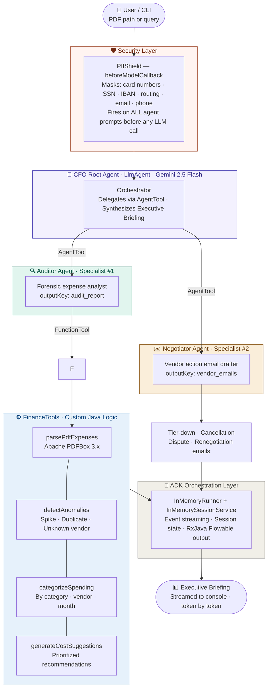

# 💀 The Shadow Auditor
### Finance Intelligence Agent — PS #4

> *"Every dollar that leaks through the cracks has a paper trail. We find it."*

An AI-powered multi-agent system built on **Google ADK (Java 0.2.x)** that monitors company expenses, detects anomalous transactions, categorizes spending patterns, and triggers vendor action emails — all with PII protection baked in.

---

## Architecture

The Shadow Auditor is a 3-agent hierarchical system built on Google ADK. Every request flows through a PII masking interceptor before any LLM call, then through a root CFO orchestrator that delegates to two specialists via `AgentTool`.


| Layer | Component | Role |
|-------|-----------|------|
| Security | `PIIShield` | `beforeModelCallback` — regex-masks PII before every LLM call |
| Orchestration | `CFOAgent` | Root `LlmAgent` — delegates via `AgentTool`, produces briefing |
| Specialist | `AuditorAgent` | PDF parsing, anomaly detection, spend categorization |
| Specialist | `NegotiatorAgent` | Drafts vendor action emails from audit findings |
| Tools | `FinanceTools` | 4 `@Schema`-annotated Java functions registered as `FunctionTool` |
| Runtime | `InMemoryRunner` | ADK event streaming + `InMemorySessionService` session management |

## 🧩 Component Reference

| File | Role | ADK Concept Used |
|------|------|-----------------|
| `ShadowAuditorApp.java` | Main entry · CLI parsing · session bootstrap | `InMemoryRunner`, `InMemorySessionService` |
| `agents/CFOAgent.java` | Root orchestrator · delegates to specialists | `LlmAgent` + `AgentTool` (wraps sub-agents) |
| `agents/AuditorAgent.java` | Forensic expense analyst | `LlmAgent` + `FunctionTool` |
| `agents/NegotiatorAgent.java` | Vendor action email drafter | `LlmAgent` (generative only) |
| `interceptors/PIIShield.java` | PII masking on all prompts | `LlmAgent.BeforeModelCallback` |
| `tools/FinanceTools.java` | PDF parsing + anomaly detection engine | `@Schema` annotated `FunctionTool` |
| `tools/SamplePdfGenerator.java` | Test PDF generator (PDFBox) | — |
| `config/AppConfig.java` | Centralized config (env → sys prop → file) | — |

---

## ⚡ Quick Start

### Prerequisites
- Java 21+
- Maven 3.9+
- Google AI API key with Gemini access

### 1. Clone & Configure

```bash
# Set your API key (required)
export GOOGLE_API_KEY=your_gemini_api_key_here

# Optional overrides
export GEMINI_MODEL=gemini-2.0-flash          # default
export FINANCE_SAMPLE_PDF=path/to/expenses.pdf
```

### 2. Generate a Sample PDF (for testing)

```bash
mvn compile exec:java -Dexec.mainClass="com.auditor.tools.SamplePdfGenerator"
# → generates: src/main/resources/sample_expenses.pdf
```

### 3. Run the Full Audit

```bash
# Single-shot audit (default PDF from config)
mvn compile exec:java -Dexec.mainClass="com.auditor.ShadowAuditorApp"

# Specify a PDF path
mvn compile exec:java -Dexec.mainClass="com.auditor.ShadowAuditorApp" \
  -Dexec.args="--pdf-path=/path/to/your/expenses.pdf"

# Interactive REPL mode
mvn compile exec:java -Dexec.mainClass="com.auditor.ShadowAuditorApp" \
  -Dexec.args="--interactive"
```

### 4. Build Fat JAR

```bash
mvn clean package -DskipTests
java -jar target/shadow-auditor-1.0.0.jar --pdf-path=expenses.pdf
```

### 5. Run Tests

```bash
mvn test
```

---

## 🔍 PII Shield — What Gets Masked

The `PIIShield` interceptor fires as a `beforeModelCallback` on **every** LLM prompt:

| Pattern | Example Input | Masked As |
|---------|--------------|-----------|
| Credit/Debit card (PAN) | `4532-1234-5678-9012` | `[CARD-MASKED]` |
| US SSN / Tax ID | `123-45-6789` | `[SSN-MASKED]` |
| IBAN | `GB29 NWBK 6016 1331 9268 19` | `[IBAN-MASKED]` |
| ABA Routing number | `021000021` | `[ROUTING-MASKED]` |
| Bank account | `ACCT: 123456789012` | `[ACCT-MASKED]` |
| Email address | `cfo@acme.com` | `[EMAIL-MASKED]` |
| Phone number | `+1 (555) 123-4567` | `[PHONE-MASKED]` |

---

## 🚨 Anomaly Detection Logic

`FinanceTools.detectAnomalies()` runs four detection passes:

| Detection | Logic | Severity |
|-----------|-------|----------|
| **Price Spike** | Vendor amount >30% above that vendor's own mean | HIGH |
| **Duplicate Charge** | Same vendor + same amount within 24 hours | CRITICAL |
| **Unrecognized Vendor** | Vendor not in 40+ entry trusted whitelist | MEDIUM |
| **Large Transaction** | Single transaction >$10,000 | HIGH |

---

## 📧 Email Types — NegotiatorAgent

| Trigger | Email Type | Tone |
|---------|-----------|------|
| DUPLICATE_CHARGE | Price Dispute / Chargeback Request | Legal-adjacent, firm |
| PRICE_SPIKE | Renegotiation Request | Strategic partnership |
| UNRECOGNIZED_VENDOR | Cancellation / Verification Notice | Unambiguous |
| HIGH spend + renewal | Tier-Down Request | Firm but collaborative |

---

## 🗂️ Project Structure

```
shadow-auditor/
├── pom.xml
├── README.md
└── src/
    ├── main/
    │   ├── java/com/auditor/
    │   │   ├── ShadowAuditorApp.java          ← Main entry
    │   │   ├── agents/
    │   │   │   ├── CFOAgent.java              ← Root orchestrator
    │   │   │   ├── AuditorAgent.java          ← Specialist #1
    │   │   │   └── NegotiatorAgent.java       ← Specialist #2
    │   │   ├── config/
    │   │   │   └── AppConfig.java             ← Config loader
    │   │   ├── interceptors/
    │   │   │   └── PIIShield.java             ← beforeModelCallback
    │   │   ├── model/
    │   │   │   ├── Transaction.java           ← Transaction record
    │   │   │   └── AuditReport.java           ← Report structure
    │   │   └── tools/
    │   │       ├── FinanceTools.java          ← 4 ADK-registered tools
    │   │       └── SamplePdfGenerator.java    ← Test data generator
    │   └── resources/
    │       ├── application.properties
    │       ├── logback.xml
    │       └── sample_expenses.pdf            ← Generated by SamplePdfGenerator
    └── test/
        └── java/com/auditor/
            ├── interceptors/PIIShieldTest.java
            └── tools/FinanceToolsTest.java
```

---

## 🔧 Configuration Reference

| Property | Env Var | Default | Description |
|----------|---------|---------|-------------|
| `gemini.model` | `GEMINI_MODEL` | `gemini-2.0-flash` | Gemini model to use |
| `finance.spike-threshold-percent` | `FINANCE_SPIKE_THRESHOLD_PERCENT` | `30.0` | % above mean to flag as spike |
| `finance.large-transaction-threshold` | `FINANCE_LARGE_TRANSACTION_THRESHOLD` | `10000.0` | Single txn threshold |
| `finance.sample-pdf` | `FINANCE_SAMPLE_PDF` | `src/main/resources/sample_expenses.pdf` | Default PDF path |
| — | `GOOGLE_API_KEY` or `GEMINI_API_KEY` | *(required)* | Gemini API key |

---

## 🛡️ Security Notes

- **API keys** are never logged or included in prompts
- **PII masking** happens pre-LLM — masked data never leaves the JVM unmasked
- **Session isolation** via `InMemorySessionService` — no cross-user data bleed
- All financial data stays in-process; only anonymized summaries reach the model

---

*Built for the 6-hour Finance PS #4 hackathon challenge.*  
*Stack: Java 21 · Google ADK 0.2.x · LangChain4j · Apache PDFBox 3.x · Gemini 2.0 Flash*
